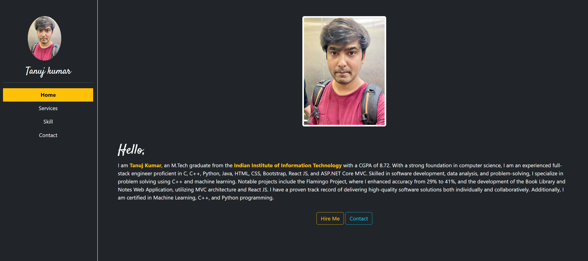
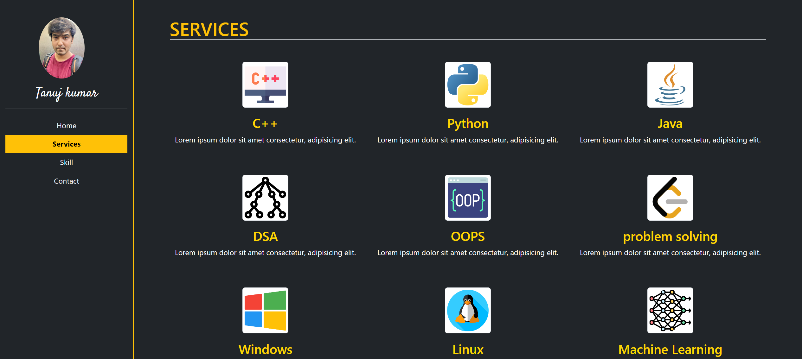
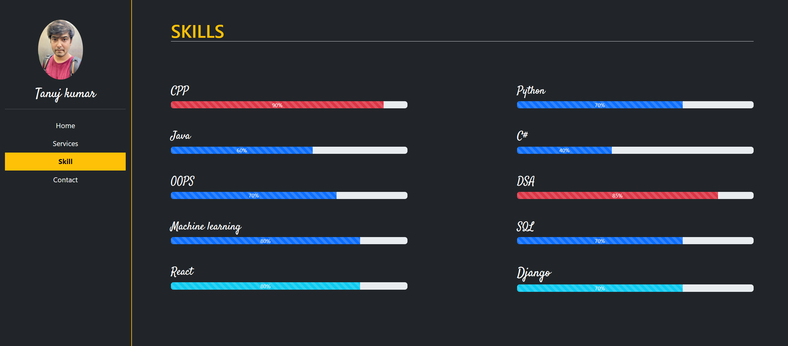

 

  

  
   
  
   <h1 class=" text-center">Welcome to my portfolio </h1>
   <h3>Exploring the Realm of Code: A Glimpse into My Journey as a Software Engineer</h3>
     
     
    
   
  

<!-- ABOUT THE PROJECT -->

## About The Project

This project is a dynamic Web Application developed with a modern tech stack to showcase its versatility and user-centric design. It serves as a comprehensive portfolio project demonstrating proficiency in a variety of web technologies.
Techstack: HTML, JavaScript, Bootstrap, CSS for front-end development. Django is used for back-end development with Python as the programming language. Font Awesome is incorporated for icons and design elements.

### Project Images

Home Page

---

services page

---

Skills

---

(<a href="#top">back to top</a>)

### Built With

This section should list any major frameworks/libraries used to bootstrap your project. Leave any add-ons/plugins for the acknowledgements section. Here are a few examples.

- [HTML](https://developer.mozilla.org/en-US/docs/Web/HTML)
- [JavaScript](https://developer.mozilla.org/en-US/docs/Web/JavaScript)
- [Bootstrap](https://getbootstrap.com)
- [CSS](https://developer.mozilla.org/en-US/docs/Web/CSS)
- [Django](https://www.djangoproject.com)
- [Python](https://www.python.org)
- [Font Awesome](https://fontawesome.com)

(<a href="#top">back to top</a>)

<!-- LICENSE -->

## License

Distributed under the MIT License. See `LICENSE.txt` for more information.

(<a href="#top">back to top</a>)

